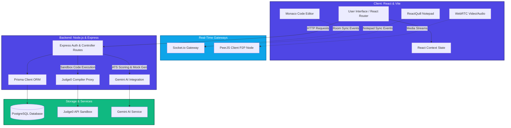
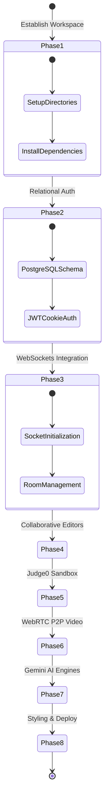

# 🚀 PeerPrep — Collaborative AI Interview Platform

PeerPrep is a state-of-the-art, full-stack collaborative platform designed to revolutionize technical preparation and remote interviewing. It bridges the gap between candidates and interviewers by combining real-time synced document/code editing, peer-to-peer WebRTC video calls, sandbox code compilation, and Google's Gemini AI for ATS resume scoring and candidate evaluation scorecard generation.

Currently, the project has successfully completed **Phase 1 (Setup)**, **Phase 2 (Database & Authentication)**, and **Phase 3 (Real-Time Sockets)** utilizing a modern **PERN Stack** (PostgreSQL, Express, React, Node.js) with Prisma ORM, secure JWT-based session tracking, and real-time Socket.io workspace syncing.

---

## 🎨 Naming & Branding Vision

To reflect both the developer-focused collaboration tools and high-end AI intelligence features, the platform's positioning leverages the following naming directions:

| Theme | Suggested Names | Brand Pitch / Focus |
| :--- | :--- | :--- |
| **Collaborative & Sync** | `PrepSync` / `SyncHire` | Focuses on real-time room sharing and working together. |
| **AI & Intelligence** | `Intervue.ai` / `HirePulse` / `MockMind` | Emphasizes smart evaluation, resume scoring, and AI mock questions. |
| **Developer-Focused** | `CodeMock` / `DevIntervue` / `PeerPrep` | Highlights the integrated Monaco code compiler and PeerJS video calls. |
| **Modern & Premium** | `TalentFlow` / `AuraPrep` / `AceSession` | Premium, sleek naming suited for high-end SaaS platforms. |

*Note: The current development workspace and database configurations are registered under **PeerPrep**.*

---

## 🏗️ Architecture & Vision Overview

The application architecture combines low-latency direct messaging, client-to-client video feeds, secure authentication gateways, and sandbox compilers:



### Stack Breakdown

*   **Frontend (Vite + React.js):** Builds a responsive user interface with protected routes using the **React Context API**, and styles elements with **Tailwind CSS**. Future releases will support the Monaco Code Editor, ReactQuill Notepad, and WebRTC elements.
*   **Backend (Node.js + Express):** Handles application routing, authentication middleware, and acts as a compiler and AI prompt proxy to safeguard secret keys.
*   **Database (PostgreSQL via Prisma ORM):** Manages relational user schemas, profile states, and transactional mappings with absolute type-safety and migrations.
*   **Socket.io Server:** Establishes live duplex connection tunnels for room sharing, cursor broadcasts, and document synchronization.
*   **PeerJS Network:** Facilitates WebRTC direct connection handshakes, keeping high-bandwidth video/audio streams off backend application servers.
*   **External Integrations:** Utilizes **Judge0 API** for code execution sandbox compiling and **Google Gemini 1.5 Flash** for ATS-score parsing and grading answers.

---

## 🔐 Authentication System & Core Features

Currently fully implemented and secured:

*   **Password Security:** Plaintext passwords are salted and hashed using `bcryptjs` before committing to the PostgreSQL schema.
*   **Secure Session Handling:** JWT tokens are issued upon successful authentication and delivered directly inside secure, **HTTP-only cookies**. This secures tokens against client-side script extraction (XSS protection).
*   **CORS Configuration:** Built-in verification filters validate origin requests, permitting reliable credentials handshakes only for trusted client URLs.

### Active Authentication Routes
*   `POST /api/register` — Create a new account (Username, Email, Password).
*   `POST /api/login` — Validate credentials, generate JWT, and attach cookie payload.

```
[User Forms] ───> [API Util / Fetch] ───> [Express Backend] ───> [Prisma ORM] ───> [PostgreSQL]
      │                                                                               │
[Home UI State] <─── [React Context] <─── [HTTP-only Cookie JWT Issued] <─────────────┘
```

---

## 🌍 Global State Management

Global authentication details are distributed across components using the React Context API:

### `DataContext` (context/DataContext.jsx)
Declares the context footprint holding user information:
*   `user`: Object containing active username, email, and ID.
*   `setUser`: Trigger function to update profile structures reactive to logout/login states.

### `DataProvider` (context/DataProvider.jsx)
Wraps application routes to ensure continuous availability:
```jsx
import React, { createContext, useState } from 'react';
import { DataContext } from './DataContext';

export const DataProvider = ({ children }) => {
  const [user, setUser] = useState(null);

  return (
    <DataContext.Provider value={{ user, setUser }}>
      {children}
    </DataContext.Provider>
  );
};
```

---

## 📁 Project Structure

```
PeerPrep/
├── backend/
│   ├── controllers/
│   │   └── authControllers.js    # Sign-up, login, and validation logic
│   ├── routes/
│   │   └── authRoutes.js         # Express endpoint mappings
│   ├── db/
│   │   └── prismaClient.js       # Prisma Client wrapper initialization
│   ├── prisma/
│   │   └── schema.prisma         # PostgreSQL models & database setup
│   ├── .env.example              # Template for server-side config
│   └── server.js                 # App configuration & middleware gateway
│
└── frontend/
    ├── src/
    │   ├── pages/
    │   │   ├── Home.jsx          # Protected dynamic home dashboard
    │   │   ├── Login.jsx         # Sign-in panel interface
    │   │   └── Signup.jsx        # Registration panel interface
    │   ├── context/
    │   │   ├── DataContext.jsx   # Context hook definition
    │   │   └── DataProvider.jsx  # Wrapper for global state mapping
    │   ├── utils/
    │   │   └── api.js            # Structured API query instance (fetch layer)
    │   ├── App.jsx               # Application navigation and routes
    │   └── main.jsx              # Client entry point
    └── package.json
```

---

## 🗓️ Phase-by-Phase Roadmap



### ✅ Completed Features
*   [x] **Phase 1: Project Setup & Init**
    *   Workspace directory routing, multi-package initializations, script pipelines.
*   [x] **Phase 2: Database & Authentication**
    *   Designed schema blueprints in Prisma mapping to active PostgreSQL tables.
    *   Engineered Bcrypt password salting pipelines and HTTP-only cookie-based JWT sessions.
    *   Built context wrappers in React for state monitoring, logging, and account page actions.
*   [x] **Phase 3: Real-Time Sockets (Socket.io)**
    *   Configured server-side Socket.io initialization with CORS verification.
    *   Engineered a room session tracker in the backend to manage user join/leave states.
    *   Exposed socket connectivity via global React context and built the dynamic `/room/:roomId` participant lobby UI.

### 🚀 Up Next
*   [ ] **Phase 4: Collaborative Workspace**
    *   Bind Monaco Code Editor and ReactQuill Notepad updates to transmit edit deltas via socket pathways.
*   [ ] **Phase 5: Code Compilation (Judge0 Integration)**
    *   Secure backend proxies directing runtime code payloads to Judge0 API sandboxes for compiling.
*   [ ] **Phase 6: P2P Audio & Video Calls (PeerJS)**
    *   Implement direct 1-to-1 WebRTC video feeds using PeerJS nodes.
*   [ ] **Phase 7: AI Interviewer & Resume Analyzer (Gemini AI)**
    *   Build multer-based PDF extractors with `pdf-parse`. Feed contents to Gemini AI along with ATS compliance prompts and resume evaluators.
*   [ ] **Phase 8: UI Styling & Deployment**
    *   Style layout with custom Tailwind grids. Set up environment properties and build configurations to deploy on Render, Railway, Vercel, or Netlify.

---

## 💻 Getting Started

### 1. Prerequisites
Ensure you have the following installed:
*   [Node.js](https://nodejs.org/) (v16+ recommended)
*   A running [PostgreSQL](https://www.postgresql.org/) database instance (local instance or hosted online, e.g., Supabase or Neon).

### 2. Environment Configurations
Create a `.env` file under the `/backend` folder with the following variables:
```env
PORT=3000
DATABASE_URL="postgresql://<username>:<password>@<host>:5432/<db_name>?schema=public"
JWT_SECRET=your_super_secure_jwt_secret_key
# Upcoming configurations
GEMINI_API_KEY=your_gemini_api_token
```

Create a `.env` file under the `/frontend` folder:
```env
VITE_API_URL=http://localhost:3000
```

### 3. Setup Commands

**Sync Database Schemas**
First, run Prisma push command to map database models to your running PostgreSQL instance:
```bash
cd backend
npx prisma db push
```

**Run Backend Environment**
Install dependencies and run the server using hot-reloading:
```bash
npm install
npm run dev
```

**Run Frontend Client**
Open another terminal, navigate to the frontend directory, install dependencies, and launch Vite:
```bash
cd ../frontend
npm install
npm run dev
```
The application interface will be live on `http://localhost:5173`.

---

## 👨‍💻 Project Development
Developed as an advanced full-stack preparation platform. Built with security, developer workflows, and real-time execution speeds in mind.
