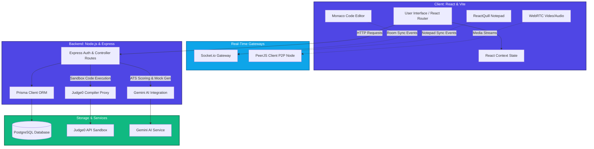

# 🚀 PeerPrep — Collaborative AI Interview Platform

PeerPrep is a state-of-the-art, full-stack collaborative platform designed to revolutionize technical preparation and remote interviewing. It bridges the gap between candidates and interviewers by combining real-time synced document/code editing, peer-to-peer WebRTC video calls, sandbox code compilation, and Google's Gemini AI for ATS resume scoring and candidate evaluation scorecard generation.

Currently, the project has successfully completed all roadmap stages, spanning **Phase 1 (Setup)** through **Phase 8 (UI Styling & Deployment)**. The platform is fully production-ready, featuring a modern **PERN Stack** (PostgreSQL, Express, React, Node.js) with Prisma ORM, secure JWT-based session tracking, Socket.io workspace syncing, database-backed Room allocation, collaborative code/notepad editors, secure code compilation proxies via Judge0, WebRTC P2P media connections via PeerJS, Gemini AI interview scorecards & ATS analyzers, and custom-styled responsive layouts.


---

## 🏗️ Architecture & Vision Overview

The application architecture combines low-latency direct messaging, client-to-client video feeds, secure authentication gateways, and sandbox compilers:



### Stack Breakdown

*   **Frontend (Vite + React.js):** Builds a responsive user interface with protected routes using the **React Context API**, and styles elements with **Tailwind CSS**. Future releases will support the Monaco Code Editor, ReactQuill Notepad, and WebRTC elements.
*   **Backend (Node.js + Express):** Handles application routing, authentication middleware, and acts as a compiler and AI prompt proxy to safeguard secret keys.
*   **Database (PostgreSQL via Prisma ORM):** Manages relational user schemas, profile states, and transactional mappings with absolute type-safety and migrations.
*   **Socket.io Server:** Establishes live duplex connection tunnels for room sharing, cursor broadcasts, and document synchronization.
*   **PeerJS Network:** Facilitates WebRTC direct connection handshakes, keeping high-bandwidth video/audio streams off backend application servers.
*   **External Integrations:** Utilizes **Judge0 API** for code execution sandbox compiling and **Google Gemini 1.5 Flash** for ATS-score parsing and grading answers.

---

## 🔐 Authentication, Room Management & Core Features

### 👤 Authentication System
Currently fully implemented and secured:

*   **Password Security:** Plaintext passwords are salted and hashed using `bcryptjs` before committing to the PostgreSQL schema.
*   **Secure Session Handling:** JWT tokens are issued upon successful authentication and delivered directly inside secure, **HTTP-only cookies**. This secures tokens against client-side script extraction (XSS protection).
*   **CORS Configuration:** Built-in verification filters validate origin requests, permitting reliable credentials handshakes only for trusted client URLs.

#### Active Authentication Routes
*   `POST /api/register` — Create a new account (Username, Email, Password).
*   `POST /api/login` — Validate credentials, generate JWT, and attach cookie payload.

```
[User Forms] ───> [API Util / Fetch] ───> [Express Backend] ───> [Prisma ORM] ───> [PostgreSQL]
      │                                                                               │
[Home UI State] <─── [React Context] <─── [HTTP-only Cookie JWT Issued] <─────────────┘
```

### 🏠 Room Management & Database Persistence
To support collaborative video calls and workspace synchronization, we have added database-backed room persistence:

*   **Room Schema Mapping:** The database includes a relational `Room` table mapping directly to host users, complete with a `RoomStatus` enum (`ACTIVE` or `ENDED`) and dynamic expiration times.
*   **Clean Room Code Generator:** Room links use an easily readable, dash-separated alphabet code (e.g. `xk3f-9qp2-mv7t`) generated using a customized `nanoid` instance that avoids confusing characters (such as `l`, `o`, `I`, `0`).
*   **Protected Access Middleware:** Room setup, joining, and validation requests are protected by a server-side `requireAuth` cookie-parsing middleware.
*   **Client Dashboard Control:** React clients navigate to a `/dashboard` room lobby where they can instantly create a meeting or submit a room code to join an active workspace.

#### Active Room Routes
*   `POST /api/rooms` — Create a new room with a random, user-friendly code (requires authentication).
*   `POST /api/rooms/join` — Validate an active room code before entering (requires authentication).
*   `GET /api/rooms/:code` — Retrieve room verification details (requires authentication).

```
 [Create/Join Action] ───> [requireAuth Middleware] ───> [nanoid Code Generator] ───> [Prisma Client] ───> [PostgreSQL Room Table]
```

---

## 🌍 Global State Management

Global authentication details are distributed across components using the React Context API:

### `DataContext` (context/DataContext.jsx)
Declares the context footprint holding user information:
*   `user`: Object containing active username, email, and ID.
*   `setUser`: Trigger function to update profile structures reactive to logout/login states.

### `DataProvider` (context/DataProvider.jsx)
Wraps application routes to ensure continuous availability:
```jsx
import React, { createContext, useState } from 'react';
import { DataContext } from './DataContext';

export const DataProvider = ({ children }) => {
  const [user, setUser] = useState(null);

  return (
    <DataContext.Provider value={{ user, setUser }}>
      {children}
    </DataContext.Provider>
  );
};
```

---

## 📁 Project Structure

```
PeerPrep/
├── backend/
│   ├── controllers/
│   │   ├── authControllers.js    # Sign-up, login, and validation logic
│   │   ├── aiControllers.js      # Gemini prompts for question generation & scorecard grading
│   │   ├── compilerControllers.js# Proxies code execution payload to Judge0 API
│   │   ├── resumeControllers.js  # PDF text parsing and resume ATS analyzer
│   │   └── roomControllers.js    # Room creation, joining, and status logic
│   ├── db/
│   │   └── prismaClient.js       # Prisma Client wrapper initialization
│   ├── middleware/
│   │   └── requireAuth.js        # Authentication cookie verification middleware
│   ├── prisma/
│   │   ├── migrations/           # Database schema migrations
│   │   └── schema.prisma         # PostgreSQL models & database setup
│   ├── routes/
│   │   ├── authRoutes.js         # Express authentication routes
│   │   ├── aiRoutes.js           # Express router mapping for Gemini AI prompt queries
│   │   ├── compilerRoutes.js     # Express code compilation route proxy
│   │   ├── resumeRoutes.js       # Express file upload handling for resume evaluation
│   │   └── roomRoutes.js         # Express room management endpoints
│   ├── sockets/
│   │   └── socketHandlers.js     # Socket.io room, editor, output, and AI handlers
│   ├── utils/
│   │   ├── gemini.js             # Initializes GoogleGenAI client using gemini-1.5-flash
│   │   ├── generateRoomCode.js   # Generates human-friendly dash-separated codes
│   │   └── languageMap.js        # Maps editor languages to Judge0 language IDs
│   ├── .env                      # Server configuration & environment variables
│   ├── package.json              # Backend dependencies and scripts
│   ├── prisma.config.ts          # Custom prisma execution options
│   └── server.js                 # App configuration & PeerJS server gateway
│
└── frontend/
    ├── public/                   # Static browser assets
    ├── src/
    │   ├── assets/               # Local icons and images
    │   ├── components/
    │   │   ├── AIPanel.jsx       # Sidebar for resume parsing and candidate scorecards
    │   │   ├── CodeEditor.jsx    # Collaborative Monaco code editor (multi-language)
    │   │   ├── Notepad.jsx       # Collaborative rich text editor using ReactQuill
    │   │   ├── Output.jsx        # Synced compilation outputs and execution trigger
    │   │   └── VideoCall.jsx     # WebRTC P2P 1-to-1 video/audio call panel
    │   ├── context/
    │   │   ├── DataContext.jsx   # Context hook definition
    │   │   └── DataProvider.jsx  # Wrapper for global state mapping
    │   ├── pages/
    │   │   ├── Dashboard.jsx     # Room creation and entry dashboard
    │   │   ├── Home.jsx          # Protected dynamic home dashboard
    │   │   ├── Login.jsx         # Sign-in panel interface
    │   │   ├── Room.jsx          # Real-time WebSocket workspace/lobby page
    │   │   └── Signup.jsx        # Registration panel interface
    │   ├── utils/
    │   │   ├── api.js            # Structured API query instance (fetch layer)
    │   │   ├── peer.js           # Singleton configuration client for PeerJS
    │   │   └── socket.js         # Socket.io-client connection instance
    │   ├── App.css               # Global application styles
    │   ├── App.jsx               # Application navigation and routes
    │   ├── index.css             # Tailwind base and entry styles
    │   └── main.jsx              # DOM entry point and react initialization
    ├── .env                      # Frontend environment setup
    ├── eslint.config.js          # Code syntax check configurations
    ├── index.html                # Vite client target template
    ├── package.json              # Client dependencies and build scripts
    └── vite.config.js            # Vite compiler configuration
```

---

## 🗓️ Phase-by-Phase Roadmap

```mermaid
stateDiagram-v2
    [*] --> Phase1: Establish Workspace
    Phase1 --> Phase2: Relational Auth
    Phase2 --> Phase3: WebSockets Integration
    Phase3 --> Phase4: Collaborative Editors
    Phase4 --> Phase5: Judge0 Sandbox
    Phase5 --> Phase6: WebRTC P2P Video
    Phase6 --> Phase7: Gemini AI Engines
    Phase7 --> Phase8: Styling & Deploy
    Phase8 --> [*]

    state Phase1 {
        [*] --> SetupDirectories
        SetupDirectories --> InstallDependencies
    }
    state Phase2 {
        [*] --> PostgreSQLSchema
        PostgreSQLSchema --> JWTCookieAuth
    }
    state Phase3 {
        [*] --> SocketInitialization
        SocketInitialization --> RoomManagement
    }
    state Phase4 {
        [*] --> MonacoCodeEditor
        MonacoCodeEditor --> QuillRichTextNotepad
    }
    state Phase5 {
        [*] --> Judge0ProxyAPI
        Judge0ProxyAPI --> OutputConsoleSync
    }
    state Phase6 {
        [*] --> PeerJSSignaling
        PeerJSSignaling --> WebRTCMediaStream
    }
    state Phase7 {
        [*] --> GeminiGenAIClient
        GeminiGenAIClient --> ResumeATSAnylyzer
    }
    state Phase8 {
        [*] --> ProductionBranding
        ProductionBranding --> RailwayRenderVercel
    }

    style Phase1 fill:#10b981,color:#fff
    style Phase2 fill:#10b981,color:#fff
    style Phase3 fill:#10b981,color:#fff
    style Phase4 fill:#10b981,color:#fff
    style Phase5 fill:#10b981,color:#fff
    style Phase6 fill:#10b981,color:#fff
    style Phase7 fill:#10b981,color:#fff
    style Phase8 fill:#10b981,color:#fff
```



### ✅ Completed Features
*   [x] **Phase 1: Project Setup & Init**
    *   Workspace directory routing, multi-package initializations, script pipelines.
*   [x] **Phase 2: Database & Authentication**
    *   Designed schema blueprints in Prisma mapping to active PostgreSQL tables.
    *   Engineered Bcrypt password salting pipelines and HTTP-only cookie-based JWT sessions.
    *   Built context wrappers in React for state monitoring, logging, and user validation check actions (`/api/me`).
*   [x] **Phase 3: Real-Time Sockets & Room Management (Socket.io & DB Persistence)**
    *   Configured server-side Socket.io initialization with CORS verification.
    *   Engineered a room session tracker in the backend to manage user join/leave states.
    *   Added a `Room` table to the database connected with Prisma PostgreSQL models.
    *   Designed nanoid-based readable room codes, custom `requireAuth` security middleware, and Express API endpoints.
    *   Built the frontend `Dashboard.jsx` meeting lobby and updated the `/room/:roomId` real-time state listeners.
*   [x] **Phase 4: Collaborative Workspace (Monaco Code Editor & Quill Notepad)**
    *   Integrated the **Monaco Code Editor** component supporting syntax highlights for Javascript, Python, C++, Java, and C, with real-time room edits synchronization.
    *   Added a collaborative rich text **Shared Notes** notepad utilizing Quill, filtering program updates from user edits to avoid echo loops.
    *   Developed backend socket memory snapshots to persist latest code/notes buffers and push states directly to newly connected room members.
*   [x] **Phase 5: Code Compilation & Output Sync (Judge0 Integration)**
    *   Engineered a secure backend API proxy (`POST /api/compiler/run`) validating input payloads and forwarding runtime code execution to the **Judge0 API**.
    *   Created a code-runner utility mapping frontend language selections to execution IDs via `languageMap.js`.
    *   Built the frontend **Output Console** component supporting execution triggers, progress flags, standard outputs, standard errors, and compile errors.
    *   Wired Socket.io hooks (`run-code-start` / `code-output`) to broadcast progress status and compile/runtime results to all room participants simultaneously.
*   [x] **Phase 6: P2P Audio & Video Calls (PeerJS Integration)**
    *   Configured an Express-based **PeerJS signaling server** in `backend/server.js` running on its own dedicated port to isolate WebRTC handshake tunnels.
    *   Wired Socket.io events (`update-peer-id`) to link active users to their PeerJS signaling IDs and dynamic client lobby broadcasts.
    *   Developed the frontend **Video Call Panel** component executing `navigator.mediaDevices.getUserMedia` for unblocked mic/cam capture.
    *   Established connection negotiation filters to prevent simultaneous-call race states by matching user lexicographical IDs.
    *   Implemented toggle selectors for muted audio tracks, paused camera feeds, and browser click-to-play autoplay unlocks.
*   [x] **Phase 7: AI Interviewer & Resume Analyzer (Gemini AI Integration)**
    *   Integrated the **Google Gemini AI (gemini-1.5-flash)** SDK to generate targeted interview questions based on candidate roles.
    *   Added backend endpoints (`POST /api/ai/generate-questions` and `POST /api/ai/evaluate-answer`) to evaluate candidate responses and outputs.
    *   Configured multi-part **PDF resume parsing** via `multer` and `pdf-parse`, extracting plaintext fields to feed into Gemini compliance metrics.
    *   Wired Socket.io hooks (`ai-questions` / `ai-evaluation`) to broadcast questions and structured evaluation cards to both room users.
    *   Built the frontend **AIPanel** component allowing resume uploads, question generation triggers, input answering, and score displays.
*   [x] **Phase 8: UI Styling & Deployment (Production Ready)**
    *   Refactored the application dashboard and workspace room views into a cohesive, dark-themed responsive split grid structure (IDE, Video Calls, and AI Sidebar).
    *   Optimized cookie sessions across different host subdomains by setting explicit credentials CORS handshakes and same-site strict configs.
    *   Redesigned interactive elements—such as PDF upload buttons, camera/microphone mute switches, code compilation execution states, and score graphs—for streamlined user journeys.
    *   Created production bundle settings ready for cloud deployments on Railway (backend), Vercel (frontend), and Neon/Supabase (PostgreSQL database).

### 🚀 Next Steps
*   [ ] **Scale & Scaling Optimization:** Implement Redis adapter caching for Socket.io state clustering.
*   [ ] **Collaborative Whiteboard:** Integrate a shared drawing canvas for technical system design preparations.

---

## 💻 Getting Started

### 1. Prerequisites
Ensure you have the following installed:
*   [Node.js](https://nodejs.org/) (v16+ recommended)
*   A running [PostgreSQL](https://www.postgresql.org/) database instance (local instance or hosted online, e.g., Supabase or Neon).

### 2. Environment Configurations
Create a `.env` file under the `/backend` folder with the following variables:
```env
PORT=3000
DATABASE_URL="postgresql://<username>:<password>@<host>:5432/<db_name>?schema=public"
JWT_SECRET=your_super_secure_jwt_secret_key
FRONTEND_URL=http://localhost:5173
JUDGE0_API_HOST=your_judge0_api_rapidapi_host_url
JUDGE0_API_KEY=your_judge0_api_rapidapi_key
PEER_PORT=3001
# Upcoming configurations
GEMINI_API_KEY=your_gemini_api_token
```

Create a `.env` file under the `/frontend` folder:
```env
VITE_API_URL=http://localhost:3000
```

### 3. Setup Commands

**Sync Database Schemas**
First, run Prisma push command to map database models to your running PostgreSQL instance:
```bash
cd backend
npx prisma db push
```

**Run Backend Environment**
Install dependencies and run the server using hot-reloading:
```bash
npm install
npm run dev
```

**Run Frontend Client**
Open another terminal, navigate to the frontend directory, install dependencies, and launch Vite:
```bash
cd ../frontend
npm install
npm run dev
```
The application interface will be live on `http://localhost:5173`.

---

## 👨‍💻 Project Development
Developed as an advanced full-stack preparation platform. Built with security, developer workflows, and real-time execution speeds in mind.
